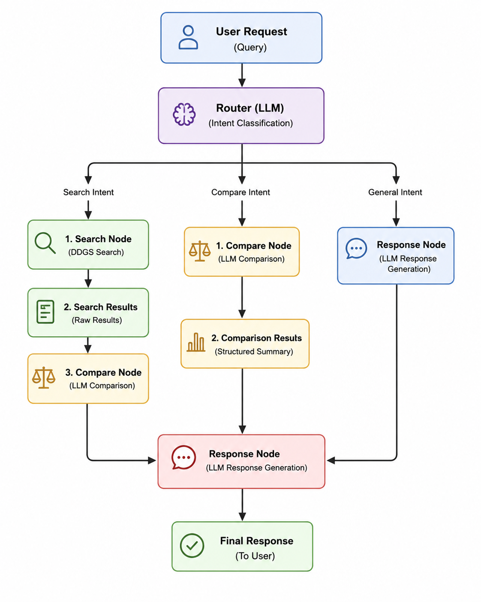
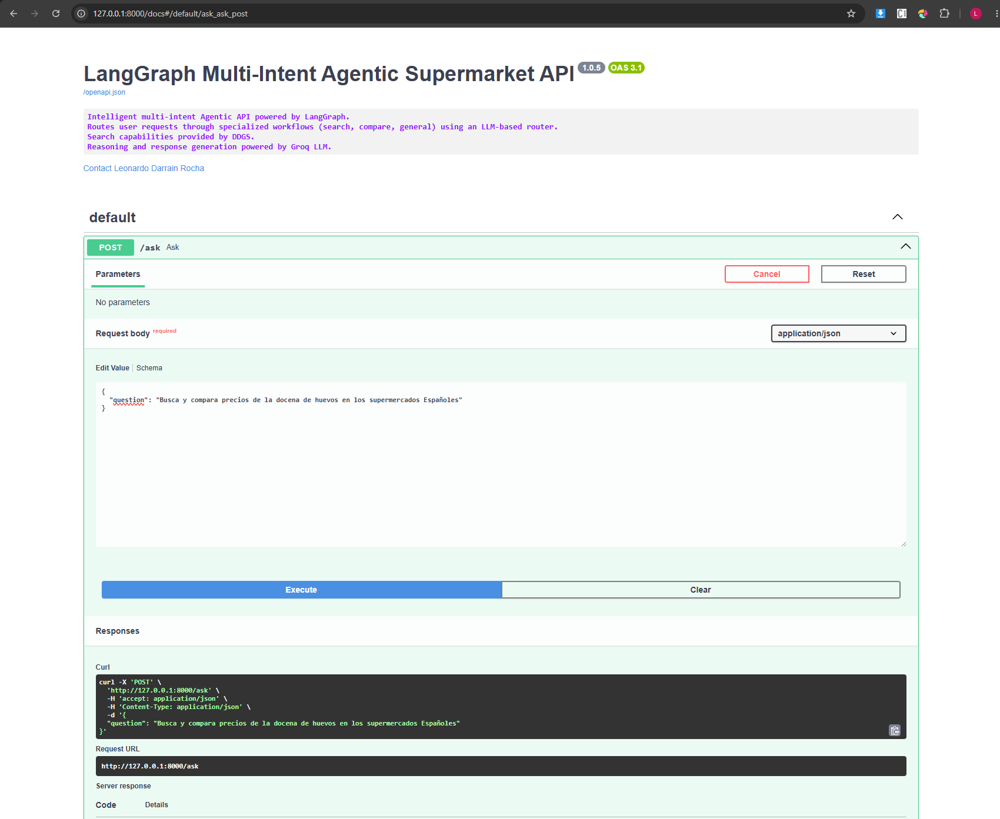
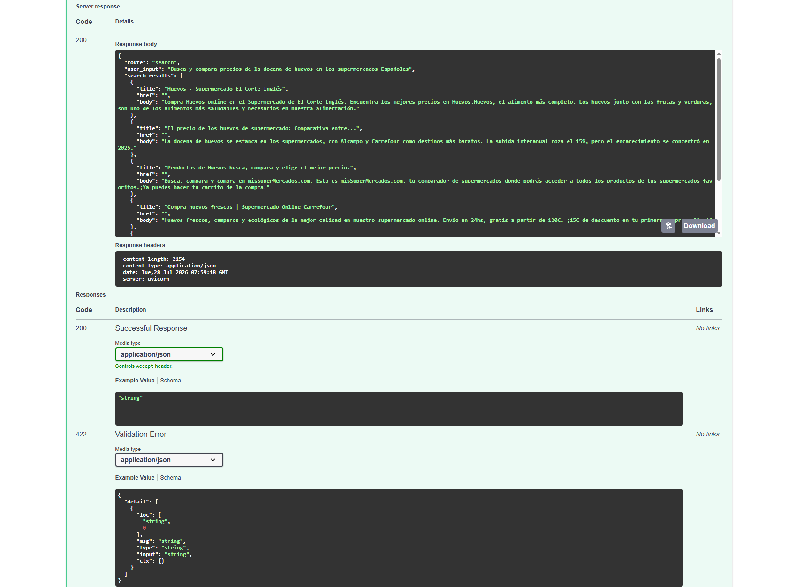
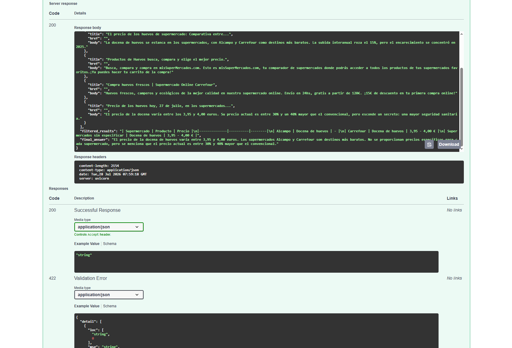

# LangGraph Agentic Supermarket Router API

## Project Overview

This project is a production focused Agentic AI system built with LangGraph. It implements an intelligent routing architecture capable of understanding user requests and selecting the most appropriate workflow before generating a response.

Unlike traditional linear AI pipelines, the system introduces explicit decision making through an LLM router, enabling specialized workflows for supermarket product searches, product comparisons, and general questions.

The project emphasizes modular architecture, workflow orchestration, reproducibility, and deployment in production environments.

## Key Features

* Multi-intent Agentic workflow built with LangGraph
* LLM-based intelligent request routing
* Dynamic graph execution
* Supermarket product search using DDGS
* LLM-powered comparison and reasoning
* REST API built with FastAPI
* Dockerized deployment
* Production-oriented modular architecture
* AWS deployment ready
* Deterministic workflow orchestration

## Architecture

The application is organized as an Agentic workflow where every responsibility is isolated into an independent component.

**API Layer**

* FastAPI REST endpoints
* Interactive Swagger documentation

**Graph Orchestration Layer**

* LangGraph StateGraph
* Conditional routing between specialized nodes

**Router Layer**

* LLM-based intent classification
* Dynamic workflow selection

**Search Layer**

* DuckDuckGo (DDGS) search integration
* Raw search result retrieval

**Comparison Layer**

* LLM reasoning over search results
* Intelligent filtering and comparison

**Response Layer**

* Final natural language answer generation

**LLM Layer**

* Groq API
* Llama-3.3-70B-Versatile

**Prompt Layer**

* Independent prompts for Router
* Compare
* Response

**State Management**

* Shared AgentState across the workflow

# System Workflow



## Project Structure

```text
src/
│
├── graph.py
├── state.py
├── main.py
│
├── api/
│   └── api.py
│
├── llm/
│   └── model.py
│
├── nodes/
│   ├── router.py
│   ├── search.py
│   ├── compare.py
│   └── response.py
│
├── prompts/
│   ├── router_prompt.py
│   ├── compare_prompt.py
│   └── response_prompt.py
│
└── tools/
    └── search_tool.py
```

## Tech Stack

* Python
* LangGraph
* LangChain
* Groq
* Llama-3.3-70B-Versatile
* FastAPI
* DDGS
* Docker
* AWS EC2

## Deployment & Infrastructure

The application is fully containerized using Docker, allowing reproducible deployments across different environments.

It exposes a REST API through FastAPI and is designed to run as an independent service that can easily integrate into larger AI ecosystems.

## API Demonstration

The project exposes an interactive Swagger interface allowing users to test the complete Agentic workflow.

Each request demonstrates the complete execution pipeline:

* Intent classification
* Dynamic graph routing
* External search
* LLM reasoning
* Final response generation







## Key Design Decisions

* Explicit workflow orchestration using LangGraph
* Separation between prompts, nodes and tools
* Independent LLM wrapper
* Shared state management across the graph
* LLM reasoning instead of manual business rules
* Modular architecture for future graph expansion
* External search decoupled from reasoning
* Dockerized deployment
* Production-ready project organization

## Future Extensions

The architecture has been intentionally designed to support future Agentic capabilities, including:

* Multi-agent collaboration
* Planning agents
* Memory integration
* Human-in-the-loop workflows
* MCP (Model Context Protocol)
* Additional specialized tools

## Status

Production system available for live demonstration during interviews.

## Repository Note

Source code is private due to infrastructure and deployment constraints.
Full technical walkthrough and live demo are available upon request.

## Author

Leonardo Darrain Rocha  
Senior Software Engineer  
https://www.linkedin.com/in/leonardo-darrain-rocha-a6062354/  
